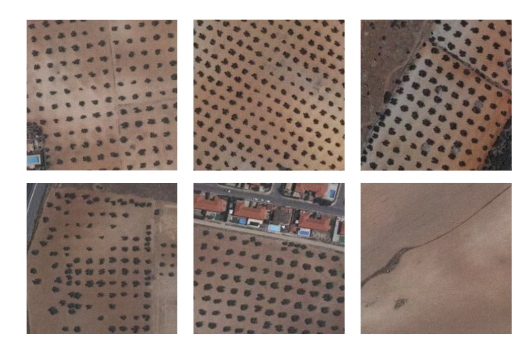

# Smjernice, upute i bilješke za lakši rad na projektu

## Izvor podataka

Kao inicijalni izvor podataka, odnosno slika za analizu predlažem korištenje SIGPAC Viewer-a iz razloga 
što su slike više rezolucije, manje zamućene te su okolne površine oko objekata/stabala jednostavnije
za obradu od onih u Katastru RH. SIGPAC-u se može pristupiti ovdje:

http://sigpac.mapa.gob.es/fega/visor/

## Lokacije 

Ovdje su navedene koordinate (prva označava lattitude, druga longitude, međusobno odvojene s ';')
povoljnih lokacija koje možemo koristiti kao izvore slika. Prilikom pregleda područja u SIGPAC-u
u donjem lijevom kutu pišu vam koordinate čime se jednostavno možemo pozicionirati na željeno područje. 

* 37°56'49''; 2°20'54'' (Puebla de Don Fadrique, planina Sierra de Segura, sjeverno od grada Lorca)
* 38°6'43 ; 2°2'51 (zapadno od grada Caravaca de Cruz)
* 38°5' ; 1°59' (sjeverno od grada Archivel)
* 38°5' 9.79" ; 2°3' 7.46" (najpravilniji raspored, najbolje pronađeno područje do sada!)
	* između brda Granja Alverde i Corral de Patrocinio 
	
	
## Spremanje podataka 

Napraviti sliku zaslona pomoću nekog od postojećih alata (npr. Lightshot), spremiti u radni direktorij 
u png formatu (poželjno u onaj s kojim radite u MATLAB-u) pod nazivom SIG_xx (xx označava brojeve - 01, 02,..., 99) 
ukoliko je slika preuzeta sa SIGPAC-a ili KAT_xx ukoliko je slika preuzeta iz Katastra RH, kako bi kasnije
mogli jednostavno odrediti izvor slike te usporediti dobivene rezultate između dvaju izvora. 

Prilikom uzimanja slike zaslona voditi računa da su sve slike približno jednake veličine te da obuhvaćaju što veći mogući
raspon situacija (npr. pravilan/nepravilan raspored objekata, većina/manjina slike sadrži objekte, prisutnost ostalih, 
neželjenih objekata na slici i sl.). Ispod su dani neki primjeri.

## Obrada u MATLAB-u

Spremljene slike iz prethodnog dijela mogu se unijeti u MATLAB. Prije same obrade slika i primjene
određenih alata/algoritama predlažem slijediti postupak iz članka: https://ieeexplore.ieee.org/stamp/stamp.jsp?tp=&arnumber=8558485
Naravno, svatko radi samo onaj dio koji mu je dodijeljen. Također, bilo bi poželjno da se prije obrade
sve slike skaliraju tako da imaju iste dimenzije. 

Korisne poveznice koje su vezane uz obradu slike u MATLAB-u:
* https://uk.mathworks.com/products/image.html
* https://uk.mathworks.com/help/images/getting-started-with-image-processing-toolbox.html

## Upload na GitHub

Korištenje GitHub-a nam olakšava spremanje, međusobnu razmjenu koda te lako prebacivanje između verzija
koda. Primjerice, napravite jednu verziju vašeg zadatka koja radi i pushate na Github. Nakon toga možete
nastaviti raditi na istom izvornom kodu te ukoliko niste zadovoljni novim modifikacijama, lako se možete
prebaciti na staru verziju koja je bila ispravna/zadovoljajuća.

Poželjno je sav rad koji uspješno/donekle uspješno implementira neki od zadanih zadataka 'pushati' na
GitHub u za to predviđeni repozitorij (za svakog člana tima sam napravio repozitorij s inicijalima njegovog
imena). Također, ukoliko vam je za potrebe izvedbe vašeg zadatka potreban dio koji je implementirao drugi član tima,
jednostavno možete preuzeti taj dio koda iz njegovog repozitorija. Preporučam da imate kopiju/clone cijelog repozitorija na računalu.

Za rad s GitHub-om, osim računa na njemu, potrebna je i instalacija Git-a, kojeg možete preuzeti ovdje:
* https://git-scm.com/downloads

Izbjegavajte GUI verziju Git-a, command line pristup osigurava veću fleksibilnost u radu. Nakon instalacije
Git-a, u radnom direktoriju možete otvoriti Git Bash desnim klikom miša te odabirom opcije 'Git Bash Here'.

Korisne poveznice vezane uz rad s Git-om:
* https://www.youtube.com/watch?v=HVsySz-h9r4
* https://git-scm.com/docs/gittutorial

