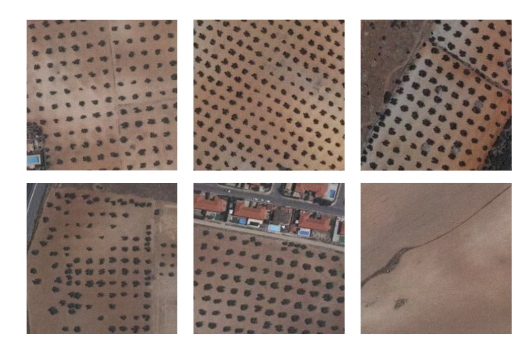
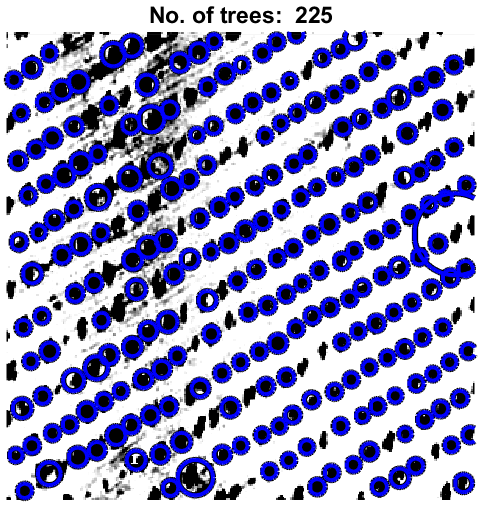
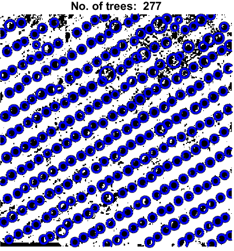

# Team project in subject *Random Signals and Processes* @ Faculty of Electrical Engineering and Computing, University of Zagreb (https://www.fer.unizg.hr/en/course/rsap_a)

Team members: Marko Čavužić, Ivan Sinković, Josip Preglej, Dino Cindrić

## Project name

Object Detection and Counting From Satellite Images

## Project tasks

1. Noise and artifacts removal from raw images
2. Color-to-grayscale conversion, image sharpening
3. Image segmentation
4. Object counting
5. Result analysis and project report writing
6. Project presentation

## Division of labour 

| Team Member    | Task |
| ------------- |:-------------:|
| Dino Cindrić     | Project organization, Noise and artifacts removal, Color-to-grayscale conversion, Image sharpening  |
| Marko Čavužić      | Image segmentation     |
| Ivan Sinković     | Object counting    |
| Josip Preglej      | Report writing, Project presentation     |

## Project outcome

The main goal of the project is the implement and develop a working method for detection and counting of objects from
satellite images using MATLAB.

## Raw input images examples

## Results examples

## References

* [1] A. Khan, U. Khan, M. Waleed, A. Khan, T. Kamal, S.N. Khan Marwat, M. Maqsood, F. Aadil: "Remote Sensing: An Automated Methodology for Olive Tree Detection and Counting in Satellite Images", 2018. IEEE Access, https://ieeexplore.ieee.org/stamp/stamp.jsp?tp=&arnumber=8558485 